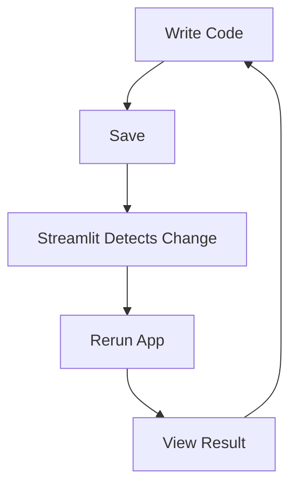
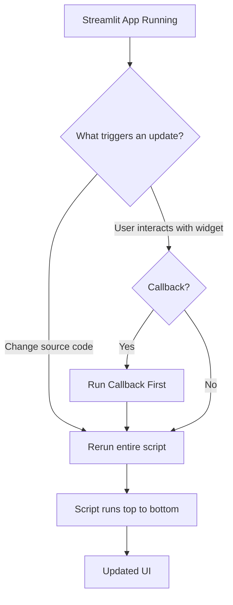

# Notes - Learning Streamlit

Follow along here: [Streamlit documentation](https://docs.streamlit.io/)

## Purpose
I'm a data nerd and love a good visualization. I tend to see a large amount of tools that solve for the 'final deliverable'. Wether that's a dashboard, report, or app, we have so many tools to choose from. As someone who has used Snowflake, I've heard a lot about Streamlit and had to try it out. What most excited me was the concept of using Streamlit as a BI-as-Code solution. This would elevate version control and remove limits on customization. Let's see if it's "lit" (sorry had to).

# [Installation](https://docs.streamlit.io/get-started/installation)

## Local Development

### [Playing Around](https://docs.streamlit.io/get-started/installation/streamlit-playground)
First off I went through Streamlit's [Playground](https://streamlit.io/playground). From a simple welcome page to an LLM chat, there were 6 different pre-built examples. These gave me an idea of what was really possible with this tool. 

I also noticed the syntax had simple, self-explanatory functions that easily described what I wanted to display. Want a button? `st.button` Want to make a line chart from data in a table? `[table_name].line_chart`. My first thoughts are that this will be an easy language to memorize syntax and easy to read if I have to come back to something or hand over the code.

### [Install](https://docs.streamlit.io/get-started/installation/command-line)
Set up was pretty easy if you've ever installed a library for python before, especially using a virtual environment. I used the command line for this. I used .venv for this project so I could:

1. Follow along with the documentation
2. Keep all subsequent packages in one place as I explore and build

I created my first [app](app.py) in this step as well. A simple "Hello World". To my surpise, when I ran the app my browser added a tab where I could see my newly created app with "Hello World" sitting there alone on the page. Quick context, I've never built sites or apps from code, all things have been analytics. So if this is normal, excuse my excitement. This is going to be fun!

## Cloud Development

I'm skipping this section for now since my main focus is building. My environments will change over time.  I will come back to this section and try both Github Codespaces for personal projects and Snowflake for enterprise proof of concepts. I'll mark the Installation section as "Done" for now.

# [Fundamentals](https://docs.streamlit.io/get-started/fundamentals)

## [Basic Concepts](https://docs.streamlit.io/get-started/fundamentals/main-concepts)

### **[Development Flow](https://docs.streamlit.io/get-started/fundamentals/main-concepts#development-flow)**

This flow works really well having my editor on one side and my brower on the other as suggested by Streamlit's docs. This proved to be an easy workflow when I tested it with my app.py I previously made.

1. **Activated my virtual environment**
2. **Ran my app**
3. **Updated the app** from `Hello World!` → `Hello Worlds!`
4. **Saved the app file**
5. **Refreshed my browser**
6. **The app was updated. That simple.**
7. **Ctrl+C to stop Streamlit server**
8. **Deactivate venv**

### **[Data Flow](https://docs.streamlit.io/get-started/fundamentals/main-concepts#data-flow)**

Since python already uses sequential execution (running from top to bottom), this doesn't change how I write my scripts. That's great and let's me code the way I normally do.

### **[Display & Style Data](https://docs.streamlit.io/get-started/fundamentals/main-concepts#display-and-style-data)**

In this section I created a file for each demonstration and will share notes under each.

**[Magic App](magic.py)**
- uses a **[magic command](https://docs.streamlit.io/develop/api-reference/write-magic/magic)** to show a dataframe created using pandas.
- I later came back to add the dataframe as a static table using `st.table(df)`

**[Write App](write.py)**
- uses `st.write()` to display the same sample data from the Magic App
= I didn't have to set the dataframe to a variable, I could just use `st.write` to display it in my app

Interesting thing about adding a table to the app is all the additional features baked in I didn't have to code.

When displaying a DataFrame in Streamlit, users can:

- ↕️ **Sort ascending/descending**
- 📊 **View statistics**
- 🎨 **Format columns**
- ↔️ **Autosize columns**
- 📌 **Pin columns**
- 🫣 **Hide columns**

**[Dataframe Styler App](dfstyler.py)**
- This was fun. I made 3 tables in 3 different ways and even got to add highlighting using the Styler.
- I also split each table into a version to see how updating an exisitng app works even using the same veriable. It was as expected, each of the 3 tables were in the app. 

**[Line Chart App](line_chart.py)**
- The default line chart came out really nice
- includes:
    - tooltip
    - a show data button
    - can download as PNG
    - make it fullscreen
    - or "Copy Vega-lite spec" which idk what that is yet

**[Map App](map.py)**
- in this one, we passed latitude and longitude data to create a map
- only able to make fullscreen without any additional coding
- uses OpenStreetMap

### Widgets

**[Widgets App](widgets.py)**
- This is where we get to add interactivity to the apps
- same as the other streamlit objects, we treat widgets as variables
- Here I learned to create
    - sliders
    - input boxes
    - checkboxes to show/hide
    - selectboxes

### Layout

**[Layout App](layout.py)**
- Here I created a sidebar to show how to organize widgets
- You can use `st.columns` to put widgets side by side

**[Progress App](progress.py)**
- This demos the ability to show a progress bar go from 0 to 100

## Advanced Concepts